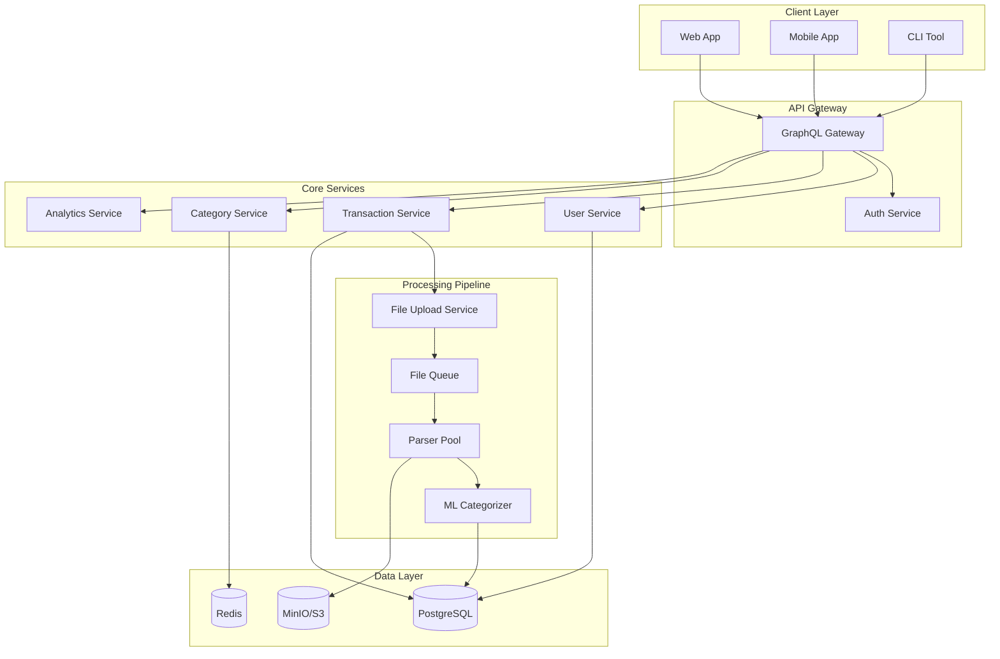
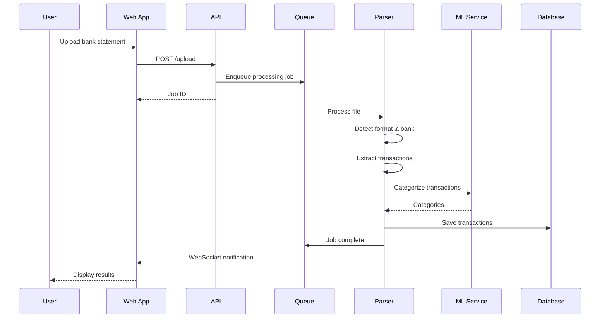

# Expense Tracker - System Architecture Document 🏗️

## Table of Contents
1. [System Overview](#system-overview)
2. [Architecture Principles](#architecture-principles)
3. [Technology Stack](#technology-stack)
4. [Component Architecture](#component-architecture)
5. [Data Flow](#data-flow)
6. [Database Design](#database-design)
7. [API Design](#api-design)
8. [Multi-language Support](#multi-language-support)
9. [File Processing Pipeline](#file-processing-pipeline)
10. [Security & Privacy](#security-privacy)
11. [Deployment Strategy](#deployment-strategy)

## System Overview

### Vision
A comprehensive, multi-user, multi-language personal finance management system that processes bank statements from various formats (PDF, Excel, CSV) with intelligent categorization and family budget tracking.

### Core Requirements
- **Multi-format Support**: PDF (with OCR), Excel (.xlsx, .xls), CSV
- **Multi-language**: Hungarian, English, German (extensible)
- **Multi-user**: Family members with separate accounts
- **Multi-bank**: Hungarian and international banks
- **Privacy-first**: Option for local-only or encrypted cloud storage
- **Intelligence**: ML-based categorization and duplicate detection

## Architecture Principles

### 1. Modularity
- Microservices-oriented design
- Clear separation of concerns
- Plugin-based bank parsers

### 2. Scalability
- Horizontal scaling for processing services
- Queue-based file processing
- Caching at multiple levels

### 3. Maintainability
- TypeScript throughout
- Comprehensive testing
- Clear documentation
- Consistent coding standards

### 4. Security
- End-to-end encryption for sensitive data
- Zero-knowledge architecture option
- GDPR compliance

## Technology Stack

### Frontend
```yaml
Framework: React 18 with TypeScript
State Management: Zustand + React Query
UI Framework: Material-UI v5 / Ant Design
Charting: Recharts + D3.js
i18n: react-i18next
Build Tool: Vite
Testing: Jest + React Testing Library
```

### Backend
```yaml
Runtime: Node.js 20 LTS
Framework: NestJS (enterprise-grade)
API: GraphQL with Apollo Server
Database: PostgreSQL + Redis
ORM: Prisma
Queue: Bull (Redis-based)
File Storage: MinIO (S3-compatible)
```

### Processing Services
```yaml
PDF Processing: 
  - pdf-parse (text extraction)
  - Tesseract.js (OCR for scanned PDFs)
  - pdf.js (rendering)

Excel Processing:
  - ExcelJS (parsing)
  - xlsx (alternative parser)

ML Service:
  - Python FastAPI
  - scikit-learn
  - spaCy (NLP)
  - TensorFlow (advanced models)
```

## Component Architecture



## Data Flow

### File Upload Flow


## Database Design

### Core Tables

```sql
-- Users & Authentication
CREATE TABLE users (
    id UUID PRIMARY KEY DEFAULT gen_random_uuid(),
    email VARCHAR(255) UNIQUE NOT NULL,
    password_hash VARCHAR(255),
    language VARCHAR(10) DEFAULT 'en',
    currency VARCHAR(3) DEFAULT 'EUR',
    timezone VARCHAR(50) DEFAULT 'UTC',
    created_at TIMESTAMP DEFAULT NOW(),
    updated_at TIMESTAMP DEFAULT NOW()
);

-- Family Groups
CREATE TABLE families (
    id UUID PRIMARY KEY DEFAULT gen_random_uuid(),
    name VARCHAR(100) NOT NULL,
    owner_id UUID REFERENCES users(id),
    created_at TIMESTAMP DEFAULT NOW()
);

CREATE TABLE family_members (
    family_id UUID REFERENCES families(id),
    user_id UUID REFERENCES users(id),
    role VARCHAR(20) DEFAULT 'member',
    nickname VARCHAR(50),
    PRIMARY KEY (family_id, user_id)
);

-- Bank Accounts
CREATE TABLE bank_accounts (
    id UUID PRIMARY KEY DEFAULT gen_random_uuid(),
    user_id UUID REFERENCES users(id),
    bank_name VARCHAR(100),
    account_number VARCHAR(100),
    account_type VARCHAR(50),
    currency VARCHAR(3),
    is_active BOOLEAN DEFAULT true,
    created_at TIMESTAMP DEFAULT NOW()
);

-- Transactions
CREATE TABLE transactions (
    id UUID PRIMARY KEY DEFAULT gen_random_uuid(),
    account_id UUID REFERENCES bank_accounts(id),
    transaction_date DATE NOT NULL,
    description TEXT,
    original_description TEXT,
    amount DECIMAL(15, 2) NOT NULL,
    currency VARCHAR(3),
    balance DECIMAL(15, 2),
    category_id UUID REFERENCES categories(id),
    merchant_id UUID REFERENCES merchants(id),
    hash VARCHAR(64) UNIQUE,
    is_duplicate BOOLEAN DEFAULT false,
    source_file_id UUID REFERENCES uploaded_files(id),
    created_at TIMESTAMP DEFAULT NOW(),
    updated_at TIMESTAMP DEFAULT NOW()
);

-- Categories
CREATE TABLE categories (
    id UUID PRIMARY KEY DEFAULT gen_random_uuid(),
    name_key VARCHAR(50) NOT NULL, -- i18n key
    icon VARCHAR(20),
    color VARCHAR(7),
    parent_id UUID REFERENCES categories(id),
    user_id UUID REFERENCES users(id), -- NULL for system categories
    created_at TIMESTAMP DEFAULT NOW()
);

-- Category Translations
CREATE TABLE category_translations (
    category_id UUID REFERENCES categories(id),
    language VARCHAR(10),
    name VARCHAR(100),
    PRIMARY KEY (category_id, language)
);

-- Merchants
CREATE TABLE merchants (
    id UUID PRIMARY KEY DEFAULT gen_random_uuid(),
    name VARCHAR(200) NOT NULL,
    normalized_name VARCHAR(200),
    category_id UUID REFERENCES categories(id),
    logo_url VARCHAR(500),
    created_at TIMESTAMP DEFAULT NOW()
);

-- ML Training Data
CREATE TABLE categorization_feedback (
    id UUID PRIMARY KEY DEFAULT gen_random_uuid(),
    transaction_id UUID REFERENCES transactions(id),
    suggested_category_id UUID REFERENCES categories(id),
    confirmed_category_id UUID REFERENCES categories(id),
    user_id UUID REFERENCES users(id),
    is_correct BOOLEAN,
    created_at TIMESTAMP DEFAULT NOW()
);

-- Uploaded Files
CREATE TABLE uploaded_files (
    id UUID PRIMARY KEY DEFAULT gen_random_uuid(),
    user_id UUID REFERENCES users(id),
    filename VARCHAR(255),
    file_type VARCHAR(20),
    file_size INTEGER,
    bank_name VARCHAR(100),
    date_range_start DATE,
    date_range_end DATE,
    transaction_count INTEGER,
    duplicate_count INTEGER,
    status VARCHAR(20),
    error_message TEXT,
    s3_key VARCHAR(500),
    created_at TIMESTAMP DEFAULT NOW()
);

-- Budgets
CREATE TABLE budgets (
    id UUID PRIMARY KEY DEFAULT gen_random_uuid(),
    family_id UUID REFERENCES families(id),
    category_id UUID REFERENCES categories(id),
    amount DECIMAL(15, 2),
    period VARCHAR(20), -- monthly, yearly
    start_date DATE,
    end_date DATE,
    created_at TIMESTAMP DEFAULT NOW()
);

-- Indexes for performance
CREATE INDEX idx_transactions_date ON transactions(transaction_date);
CREATE INDEX idx_transactions_account ON transactions(account_id);
CREATE INDEX idx_transactions_category ON transactions(category_id);
CREATE INDEX idx_transactions_hash ON transactions(hash);
CREATE INDEX idx_merchants_normalized ON merchants(normalized_name);
```

## API Design

### GraphQL Schema

```graphql
type Query {
  # User queries
  me: User!
  myFamily: Family
  
  # Transaction queries
  transactions(
    filter: TransactionFilter
    pagination: PaginationInput
  ): TransactionConnection!
  
  # Analytics queries
  spending(
    dateRange: DateRangeInput!
    groupBy: GroupByOption!
  ): SpendingAnalytics!
  
  # Category queries
  categories(language: String): [Category!]!
  suggestCategory(description: String!): CategorySuggestion!
}

type Mutation {
  # Authentication
  signUp(input: SignUpInput!): AuthPayload!
  signIn(input: SignInInput!): AuthPayload!
  
  # File upload
  uploadStatement(file: Upload!, bankId: ID): FileUploadResult!
  
  # Transaction management
  categorizeTransaction(
    transactionId: ID!
    categoryId: ID!
  ): Transaction!
  
  # Budget management
  createBudget(input: BudgetInput!): Budget!
  updateBudget(id: ID!, input: BudgetInput!): Budget!
}

type Subscription {
  fileProcessingStatus(jobId: ID!): ProcessingStatus!
  transactionAdded: Transaction!
}

# Core Types
type User {
  id: ID!
  email: String!
  language: String!
  currency: String!
  accounts: [BankAccount!]!
  family: Family
}

type Transaction {
  id: ID!
  date: Date!
  description: String!
  amount: Float!
  currency: String!
  category: Category
  merchant: Merchant
  account: BankAccount!
  isDuplicate: Boolean!
}

type Category {
  id: ID!
  name(language: String): String!
  icon: String
  color: String
  parent: Category
  children: [Category!]!
}
```

## Multi-language Support

### i18n Architecture

```typescript
// i18n/config.ts
export const i18nConfig = {
  defaultLanguage: 'en',
  supportedLanguages: ['en', 'hu', 'de'],
  fallbackLanguage: 'en',
  namespaces: [
    'common',
    'transactions',
    'categories',
    'banks',
    'errors'
  ]
};

// Language file structure
locales/
├── en/
│   ├── common.json
│   ├── transactions.json
│   └── categories.json
├── hu/
│   ├── common.json
│   ├── transactions.json
│   └── categories.json
└── de/
    ├── common.json
    ├── transactions.json
    └── categories.json
```

### Category Translation System

```json
// categories.json (English)
{
  "categories": {
    "food": "Food & Dining",
    "transport": "Transportation",
    "utilities": "Utilities",
    "shopping": "Shopping",
    "entertainment": "Entertainment",
    "health": "Health & Medical",
    "education": "Education",
    "travel": "Travel",
    "income": "Income",
    "transfer": "Transfer"
  }
}

// categories.json (Hungarian)
{
  "categories": {
    "food": "Élelmiszer és étkezés",
    "transport": "Közlekedés",
    "utilities": "Rezsi",
    "shopping": "Vásárlás",
    "entertainment": "Szórakozás",
    "health": "Egészségügy",
    "education": "Oktatás",
    "travel": "Utazás",
    "income": "Bevétel",
    "transfer": "Átutalás"
  }
}
```

## File Processing Pipeline

### PDF Processing Strategy

```typescript
interface PDFProcessor {
  // 1. Try text extraction
  extractText(buffer: Buffer): Promise<string[]>;
  
  // 2. If no text, use OCR
  performOCR(buffer: Buffer): Promise<string[]>;
  
  // 3. Parse bank-specific format
  parseTransactions(text: string[], bank: Bank): Transaction[];
  
  // 4. Validate and clean data
  validateTransactions(transactions: Transaction[]): Transaction[];
}

class PDFProcessingService {
  async processPDF(file: Buffer, bankId: string): Promise<ProcessingResult> {
    // Step 1: Detect if PDF has text layer
    const hasText = await this.hasTextLayer(file);
    
    // Step 2: Extract content
    let content: string[];
    if (hasText) {
      content = await this.extractTextContent(file);
    } else {
      // Use OCR for scanned PDFs
      content = await this.performOCR(file);
    }
    
    // Step 3: Detect bank format
    const bank = await this.detectBank(content);
    
    // Step 4: Parse transactions
    const parser = this.parserFactory.getParser(bank);
    const transactions = parser.parse(content);
    
    // Step 5: Detect duplicates
    const duplicates = await this.detectDuplicates(transactions);
    
    return {
      transactions,
      duplicates,
      bank,
      dateRange: this.extractDateRange(transactions)
    };
  }
}
```

### Excel Processing

```typescript
class ExcelProcessor {
  async processExcel(file: Buffer, bankId: string): Promise<ProcessingResult> {
    // Parse workbook
    const workbook = await this.parseWorkbook(file);
    
    // Find transaction sheet
    const sheet = this.findTransactionSheet(workbook);
    
    // Detect headers and data range
    const range = this.detectDataRange(sheet);
    
    // Map columns to transaction fields
    const mapping = this.detectColumnMapping(sheet, bankId);
    
    // Extract transactions
    const transactions = this.extractTransactions(sheet, range, mapping);
    
    return { transactions };
  }
}
```

## Security & Privacy

### Data Protection

1. **Encryption at Rest**
   - Database encryption using PostgreSQL TDE
   - File storage encryption in S3/MinIO
   - Encryption key management with HashiCorp Vault

2. **Encryption in Transit**
   - TLS 1.3 for all API communications
   - Certificate pinning for mobile apps
   - WebSocket over TLS for real-time updates

3. **Zero-Knowledge Option**
   - Client-side encryption before upload
   - Server never sees unencrypted data
   - User manages encryption keys

### Privacy Features

```typescript
interface PrivacySettings {
  dataRetention: 'forever' | '1year' | '6months' | '3months';
  shareWithFamily: boolean;
  allowMLTraining: boolean;
  encryptionMode: 'server' | 'client' | 'none';
  autoDeleteFiles: boolean;
}
```

## Deployment Strategy

### Development Environment
```yaml
docker-compose.yml:
  services:
    frontend:
      build: ./frontend
      ports: ["3000:3000"]
    
    backend:
      build: ./backend
      ports: ["4000:4000"]
    
    postgres:
      image: postgres:15
      volumes: ["./data/postgres:/var/lib/postgresql/data"]
    
    redis:
      image: redis:7
    
    minio:
      image: minio/minio
      volumes: ["./data/minio:/data"]
```

### Production Deployment

#### Option 1: Cloud Native (AWS/GCP/Azure)
```yaml
Frontend: CloudFront + S3
Backend: ECS/GKE/AKS
Database: RDS/Cloud SQL/Azure Database
Cache: ElastiCache/Memorystore/Azure Cache
Storage: S3/Cloud Storage/Blob Storage
Queue: SQS/Pub-Sub/Service Bus
```

#### Option 2: Self-Hosted
```yaml
Frontend: Nginx
Backend: Docker Swarm/Kubernetes
Database: PostgreSQL cluster
Cache: Redis Sentinel
Storage: MinIO cluster
Queue: RabbitMQ
```

#### Option 3: Hybrid
```yaml
Frontend: Vercel/Netlify
Backend: Railway/Render
Database: Supabase/Neon
Storage: Cloudflare R2
```

## Development Phases

### Phase 1: Foundation (Weeks 1-4)
- [ ] Database schema setup
- [ ] Basic authentication
- [ ] File upload infrastructure
- [ ] CSV parser implementation
- [ ] Basic transaction CRUD

### Phase 2: Processing (Weeks 5-8)
- [ ] PDF text extraction
- [ ] Excel parser
- [ ] Bank format detection
- [ ] Duplicate detection
- [ ] Basic categorization

### Phase 3: Intelligence (Weeks 9-12)
- [ ] ML categorization service
- [ ] OCR for scanned PDFs
- [ ] Merchant recognition
- [ ] Spending predictions

### Phase 4: Multi-user (Weeks 13-16)
- [ ] Family management
- [ ] Shared budgets
- [ ] Permission system
- [ ] Activity feeds

### Phase 5: Analytics (Weeks 17-20)
- [ ] Advanced reporting
- [ ] Budget tracking
- [ ] Goal setting
- [ ] Financial insights

### Phase 6: Polish (Weeks 21-24)
- [ ] Mobile app
- [ ] Performance optimization
- [ ] Security audit
- [ ] Documentation

## Testing Strategy

```yaml
Unit Tests: 80% coverage minimum
Integration Tests: All API endpoints
E2E Tests: Critical user flows
Performance Tests: File processing benchmarks
Security Tests: OWASP Top 10
Accessibility Tests: WCAG 2.1 AA compliance
```

## Monitoring & Observability

```yaml
Metrics: Prometheus + Grafana
Logging: ELK Stack (Elasticsearch, Logstash, Kibana)
Tracing: Jaeger/Zipkin
Error Tracking: Sentry
Uptime Monitoring: UptimeRobot/Pingdom
```

## API Rate Limiting

```typescript
interface RateLimits {
  fileUpload: {
    maxFiles: 10,
    windowMs: 3600000, // 1 hour
  },
  apiCalls: {
    maxRequests: 1000,
    windowMs: 60000, // 1 minute
  },
  mlProcessing: {
    maxRequests: 100,
    windowMs: 3600000, // 1 hour
  }
}
```

## Conclusion

This architecture provides:
- **Scalability** through microservices and queue-based processing
- **Flexibility** with plugin-based parsers and multi-language support
- **Security** with encryption and privacy options
- **Intelligence** through ML-based categorization
- **Reliability** with comprehensive testing and monitoring

The system is designed to grow from a simple expense tracker to a comprehensive financial management platform while maintaining code quality and user privacy.